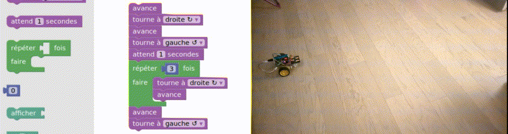

# Scratch robot

Control and program a robot with scratch language.




## Install

``` bash
git clone git@github.com:alcalyn/scratch-robot.git

cd scratch-robot/

# Needs blockly and JS-
cd www/
git clone git@github.com:google/blockly.git
git clone git@github.com:NeilFraser/JS-Interpreter.git
cd ../

cp .env.dist .env

make
```

Then go to <http://0.0.0.0:8480/index.html>.


## License

This library is under [MIT License](LICENSE).
